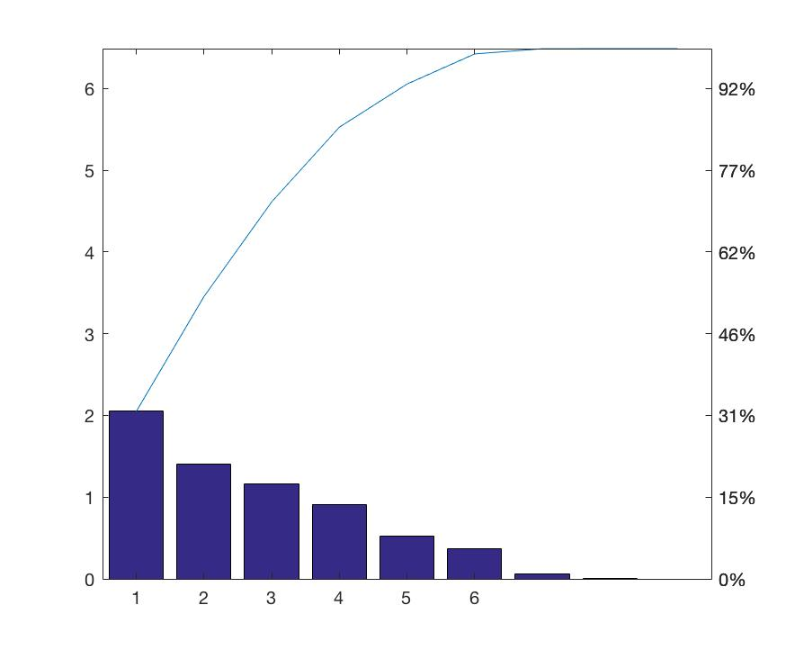
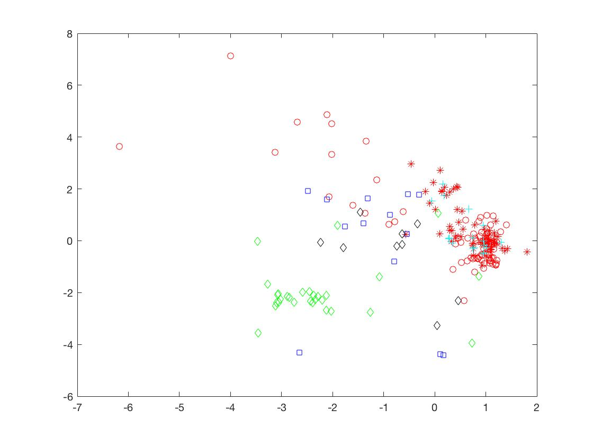
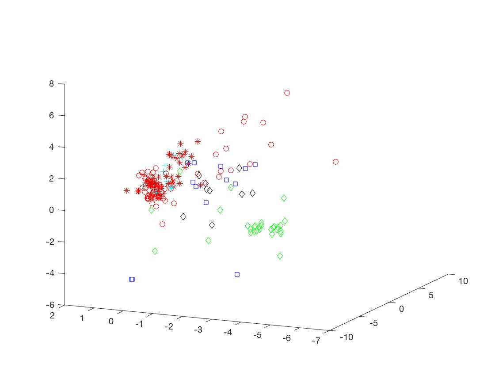
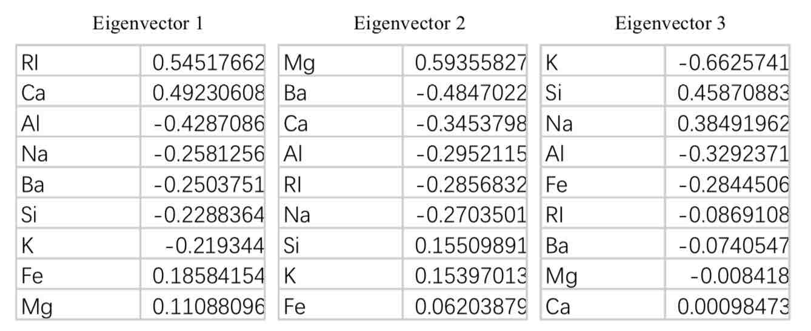
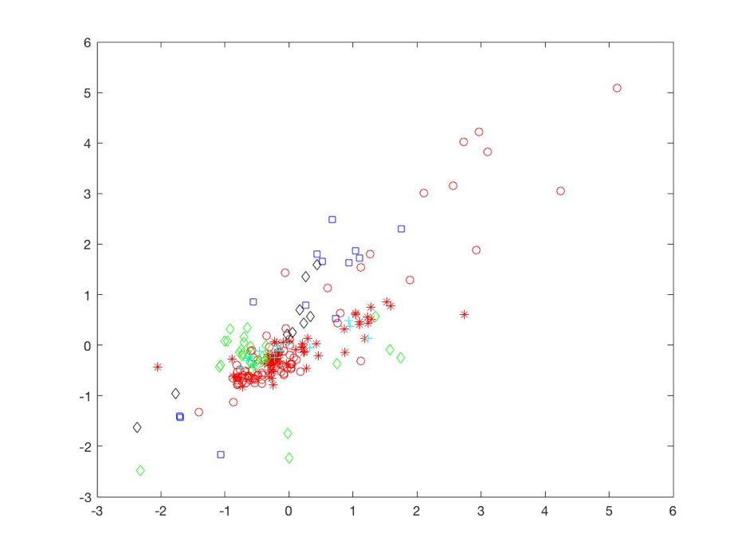
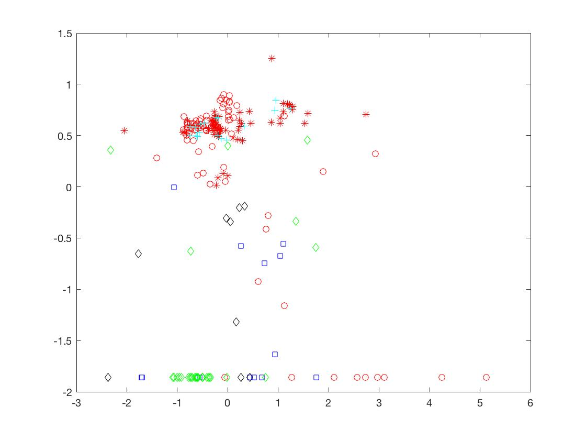
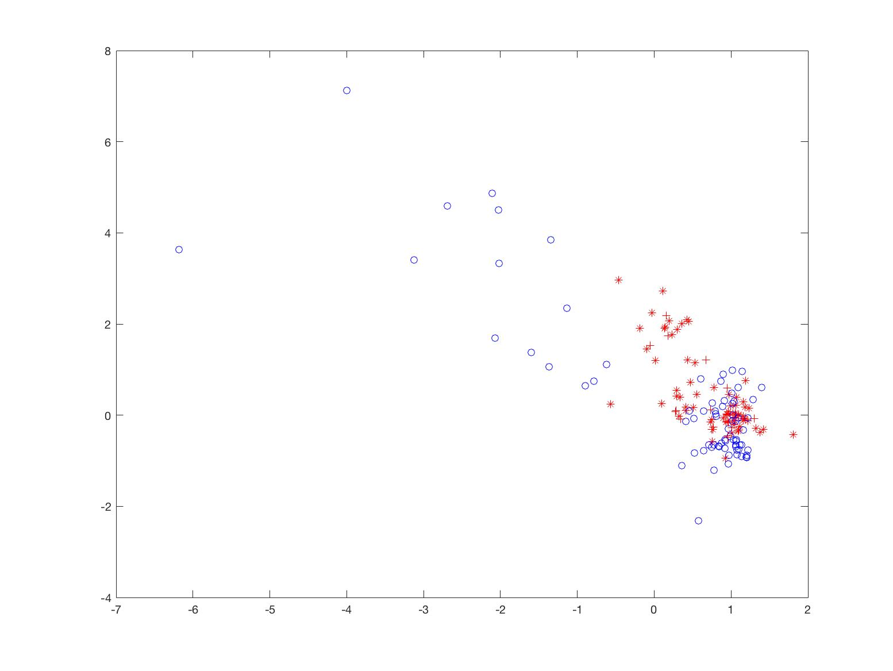
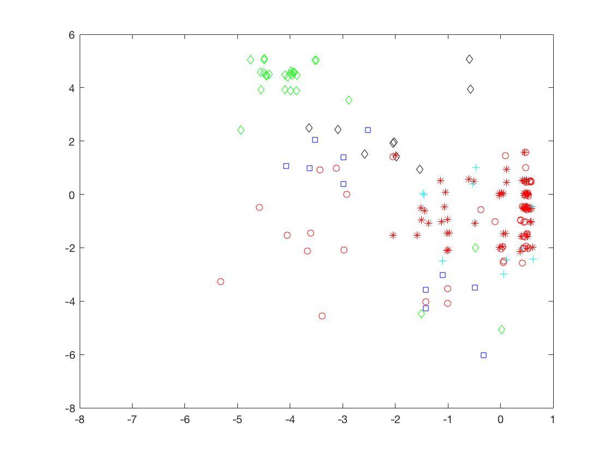

# Intelligent_Data_Analysis
This is the course project for the course Intelligent Data Analysis. It uses PCA and SOM to analyze the property of a high-dimensional data set.

# Investigating the Property of Glass from a High Dimensional Data Set

 

Nan ZHANG

Student ID: 11510613

July 7, 2017

 

## 1. Preamble

I have chosen a data set with various attributes for different type of glasses (available at <http://archive.ics.uci.edu/ml/datasets/Glass+Identification>). The glasses were classified into 7 types, float-processed building windows, non-float-processed building windows, float-processed vehicle windows, non-float-processed vehicle windows (missing in this data set), containers, tableware, headlamps. Each of them were labeled with number 1 to 7 by default. There are 10 attributes attached to them, including an ID number. The rest of the attributes are refractive index, Na, Mg, Al, Si, K, Ca, Ba, Fe.

 

## 2. Data Processing

The ID number is not relevant to the research, so only the 9 physical and chemical properties of the glass were considered. All of them are all continuous variables. To rescale the variables, I calculated the mean value and standard deviation  for each attribute, and use  to normalize the variables.

 

## 3. Research Questions

For the research, I tried to answer the following questions:

  1. What are the dominant properties that determine the types of glasses?

  2. What are the differences between float-processed and non-float-processed glasses? Also, windows and others?

  3. Is it possible to distinguish the glasses by just observing (the refraction)?

 

## 4. Dominant Properties

There are 9 attributes in the data set that contribute to classification, obviously we cannot consider each of them – it is not intuitive to see data points in a 9-dimensional space. Therefore, PCA could be adopted to take out unimportant dimensions. The approach is to use eigendecomposition to find a vector space that the covariance of different previous axis is zero, and calculate the eigenvalues and eigenvectors at the same time. **Figure 1** shows the eigenvalues and cumulative value.

As shown in the figure, the first two eigenvalues can account for 53.1% of the credibility and the first three can represent 71.0%. The data can be projected onto a 2-D or 3-D space, whose axis are the eigenvectors. The projections are shown in **Figure 2** and **Figure 3**.

**Figure 1.** Eigenvalues and cumulative eigenvalues.

**Figure 2.** Red markers for building windows (‘*’ for float-processed, ‘o’ for non-float-processed), cyan for vehicle windows, blue for containers, black for tableware, green for headlamps.

**Figure 3.** Label scheme is the same as in Figure 2.

 

To find out the meaning of eigenvectors and what they mean, I examined the components of the first three eigenvectors, the results are shown in **Table 1**.

 

**Table 1.** Eigenvector ordered in descending absolute eigenvalues **(**RI for Refraction Index).

 

The first Eigenvector represents mainly the refraction index, the amount of calcium and aluminum. The second eigenvector represents the amount of magnesium barium and calcium. The third represents the amount of potassium silicon and sodium. 

Unfortunately, it seems that we cannot reduce the attribute to only one or two, because each eigenvector represents different properties of the glasses. We could assume, with large uncertainty, that refraction index and the amount of Ca and Mg may be the dominant attributes. However, the eigenvalues of the first and second eigenvectors are quite close (**Figure 1**), so that the significance of RI, Ca, Mg and Ba are not so distinguishable.

On the other hand, the 2-D projection in **Figure 2** shows that there are some patterns. The red ones (building windows) and cyan ones (vehicle windows) are mostly concentrated in the right middle region, meaning the value on the x axis is large. We have already seen in Table 1 that the first eigenvector represents the refraction index, and therefore glass used for windows will have high refraction index. Another distinguishable pattern is the green markers (headlamps), with relatively lower x value and y value, thus lower refraction index and lower amounts of Ca, Mg, Ba. Other points are not distinguishable.

If we plot RI and Ca, RI and Mg in x-y planes, the result will be like in **Figure 4** and **5**. They are not so intuitive as in PCA.

**Figure 4.** RI as x axis, Ca as y axis.

**Figure 5.** RI as x axis, Mg as y axis.

 

## 5. Float and Non-float

In Wikipedia, the float glass is described as follows: Float glass is a sheet of glass made by floating molten glass on a bed of molten metal, typically tin, although lead and various low melting point alloys were used in the past. This method gives the sheet uniform thickness and very flat surfaces. Modern windows are made from float glass. Most float glass is soda-lime glass, but relatively minor quantities of specialty borosilicate and flat panel display glass are also produced using the float glass process.

​            Therefore, for the float processed glasses, we hypothesized that the projection value on the first eigenvector may be large (**Table 1**). I leave out the unrelated data (containers, tableware and headlamps) and label the float-processed to be red and non-float-processed blue. The result is shown in **Figure 6**.

 

**Figure 6.** Float (red, ‘*’ for building windows and ‘o’ for vehicle windows) and non-float (blue), projected on eigenvector 1 and 2.

 

Most of the data are not separable, and only a few blue points have lower x-value. Therefore, there is no clear pattern.

 

## 6. Self-Organizing Map

Apart from finding linear structure, which PCA is fully capable of, there may be nonlinear structure within the data space. One of the approach is to use a Self-Organizing Map. The following investigation will focus on implementing SOM to find possible non-linear structure in the data space.

The map was initialized to be 25*17 in size, with each node’s z-component 0. After iteration, the outcome is shown in **Figure 7**. To have an intuitive view of the map, I projected the data onto the map. For data point , there is a node on the map that is closest to it, and assign that node to be the origin  temporarily. We take the vector starting from the origin  and ended with the data point , and call it . The neighboring three points of the origin  could form of grid, and we could use two edges of grid to specify the  axis and  axis on that grid. The vector  could be projected on the grid and yielding a coordinate ), added by the coordinate of  measured on the map, we could get the final coordinate of the point after projection. For each of the data, repeat the process. The projection on SOM is shown in **Figure 8**. The red ones and green ones are quite separate from each other, but the total pattern does not change significantly compared with **Figure 2**. And **Figure 7** shows that the map has folded to itself a lot, therefore maybe there is no nonlinear structure in the data set.

 

**Figure 7.**

**Figure 8.**

## 7. Conclusion

Overall, PCA can give a clear demonstration of the data set, and there is no significant nonlinear structure. Several components such as RI, Ca, Mg and Ba all contribute the data pattern. Interestingly, the building windows and headlamps are the most different glasses.
